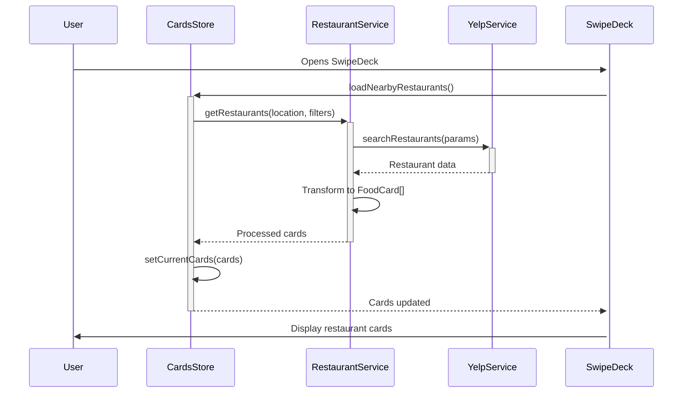
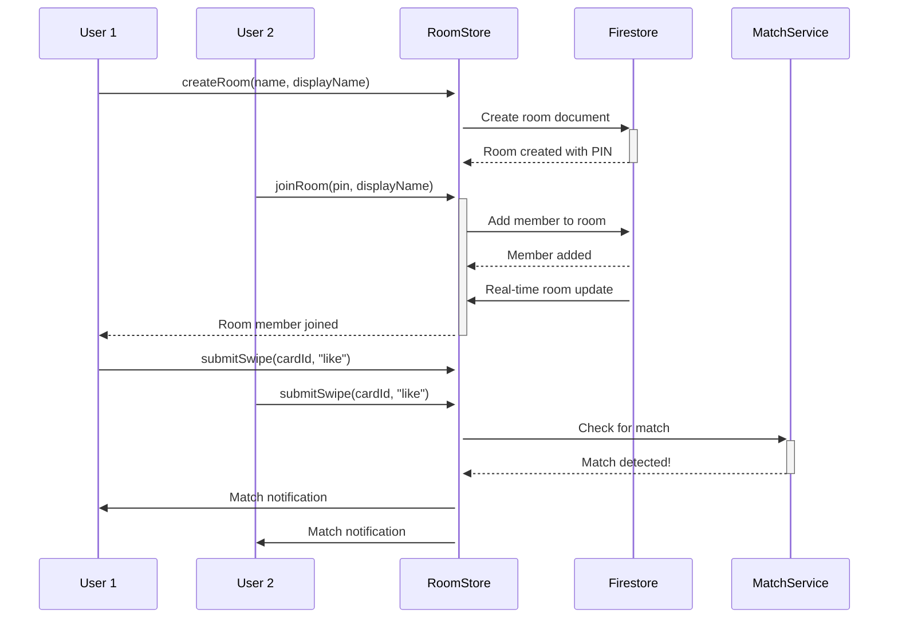

# SwipeDish Technical Architecture

This document provides a comprehensive overview of SwipeDish's technical architecture, design patterns, and implementation details.

## 📋 Table of Contents

- [System Overview](#system-overview)
- [Frontend Architecture](#frontend-architecture)
- [State Management](#state-management)
- [Services Layer](#services-layer)
- [Data Flow](#data-flow)
- [Security & Privacy](#security--privacy)
- [Performance Optimizations](#performance-optimizations)
- [Testing Strategy](#testing-strategy)

## 🏗️ System Overview

SwipeDish follows a modern React Native architecture with clear separation of concerns:

```
┌─────────────────┐    ┌──────────────────┐    ┌─────────────────┐
│   Presentation  │    │   Business Logic │    │   Data Sources  │
│     Layer       │◄──►│      Layer       │◄──►│      Layer      │
├─────────────────┤    ├──────────────────┤    ├─────────────────┤
│ • Screens       │    │ • Stores         │    │ • Firebase      │
│ • Components    │    │ • Services       │    │ • Yelp API      │
│ • Navigation    │    │ • Utils          │    │ • Google Maps   │
│ • Styling       │    │ • Validation     │    │ • AsyncStorage  │
└─────────────────┘    └──────────────────┘    └─────────────────┘
```

### Technology Stack

- **React Native 0.74+**: Cross-platform mobile framework
- **Expo SDK 51+**: Development and deployment platform
- **TypeScript 5.x**: Type-safe development
- **Zustand 4.x**: Lightweight state management
- **Firebase 9.x**: Backend-as-a-Service (Authentication, Firestore)
- **React Navigation 6.x**: Navigation and routing

## 🎨 Frontend Architecture

### Component Hierarchy

```
App.tsx
├── NavigationContainer
    ├── TabNavigator
    │   ├── SwipeDeckScreen
    │   │   ├── SwipeDeck
    │   │   │   ├── SwipeCard (multiple)
    │   │   │   └── EmptyState
    │   │   ├── RoomInput (modal)
    │   │   └── MatchBanner
    │   ├── ExploreScreen
    │   │   ├── FilterPanel
    │   │   ├── RestaurantList
    │   │   └── MapModal
    │   ├── MatchesScreen
    │   │   ├── MatchesAnalytics
    │   │   └── MatchCard (multiple)
    │   ├── FavoritesScreen
    │   │   └── FavoriteCard (multiple)
    │   └── ProfileScreen
    │       ├── PreferencesModal
    │       └── SettingsPanel
    └── StackNavigator (overlays)
        ├── AuthScreen
        ├── OnboardingScreen
        └── UsernameScreen
```

### Design System

#### Color Palette

```typescript
const colors = {
  primary: '#FF6B6B', // Main accent color
  secondary: '#4ECDC4', // Secondary accent
  background: '#1A1A1A', // Dark background
  surface: '#2D2D2D', // Card backgrounds
  text: '#FFFFFF', // Primary text
  textSecondary: '#CCCCCC', // Secondary text
  success: '#51CF66', // Success states
  warning: '#FFD43B', // Warning states
  error: '#FF6B6B', // Error states
};
```

#### Typography Scale

```typescript
const typography = {
  h1: { fontSize: 32, fontWeight: 'bold' },
  h2: { fontSize: 24, fontWeight: '600' },
  h3: { fontSize: 20, fontWeight: '600' },
  body: { fontSize: 16, fontWeight: '400' },
  bodySmall: { fontSize: 14, fontWeight: '400' },
  caption: { fontSize: 12, fontWeight: '400' },
};
```

#### Spacing System

```typescript
const spacing = {
  xs: 4, // Micro spacing
  sm: 8, // Small spacing
  md: 16, // Medium spacing (base unit)
  lg: 24, // Large spacing
  xl: 32, // Extra large spacing
  xxl: 48, // Maximum spacing
};
```

## 🗄️ State Management

### Zustand Store Architecture

SwipeDish uses a modular Zustand architecture with separate stores for different domains:

```typescript
// Combined store pattern
const useAppStore = () => ({
  ...useAuthStore(),
  ...useRoomStore(),
  ...useCardsStore(),
  ...useFavoritesStore(),
  ...usePreferencesStore(),
});
```

### Store Responsibilities

#### AuthStore (`useAuthStore.ts`)

```typescript
interface AuthState {
  // State
  user: User | null;
  userId: string | null;
  isLoading: boolean;
  error: string | null;
  forceAuthScreen: boolean;

  // Actions
  signInWithEmail: (email: string, password: string) => Promise<void>;
  signUpWithEmail: (email: string, password: string, displayName: string) => Promise<void>;
  signInWithGoogle: () => Promise<void>;
  signInAnonymously: () => Promise<void>;
  signOut: () => Promise<void>;
  setUser: (user: User | null) => void;
}
```

#### RoomStore (`useRoomStore.ts`)

```typescript
interface RoomState {
  // State
  currentRoom: Room | null;
  matches: Match[];
  isLoadingMatches: boolean;

  // Real-time listeners
  unsubscribeRoom?: () => void;
  unsubscribeMatches?: () => void;

  // Actions
  createRoom: (name: string, displayName: string, userId: string) => Promise<Room>;
  joinRoom: (pin: string, displayName: string, userId: string) => Promise<Room | null>;
  leaveRoom: (userId?: string) => Promise<void>;
  submitSwipe: (cardId: string, action: SwipeAction, userId: string) => Promise<void>;
  loadMatches: (userId: string) => Promise<void>;
}
```

#### CardsStore (`useCardsStore.ts`)

```typescript
interface CardsState {
  // State
  currentCards: FoodCard[];
  currentCardIndex: number;
  userLocation: Location | null;
  isLoading: boolean;

  // Actions
  setCurrentCards: (cards: FoodCard[]) => void;
  setCurrentCardIndex: (index: number) => void;
  setUserLocation: (location: Location | null) => void;
  nextCard: () => void;
  loadNearbyRestaurants: () => Promise<void>;
}
```

### State Persistence

- **AsyncStorage**: Local persistence for user preferences and favorites
- **Firebase Firestore**: Cloud synchronization for rooms, matches, and user data
- **Zustand Persist**: Automatic state hydration on app launch

## 🔧 Services Layer

### Service Architecture Pattern

```typescript
// Base service pattern
export class BaseService {
  protected static handleError(error: unknown, context: string): never {
    const sanitizedError = ErrorSanitization.logAndSanitizeError(error, context);
    throw new Error(sanitizedError);
  }

  protected static async executeWithRetry<T>(
    operation: () => Promise<T>,
    maxRetries: number = 3
  ): Promise<T> {
    // Retry logic with exponential backoff
  }
}
```

### RestaurantService (`restaurantService.ts`)

Primary interface for restaurant data management:

```typescript
export class RestaurantService extends BaseService {
  // Multi-strategy restaurant fetching
  static async getRestaurants(
    filters?: RestaurantFilters,
    location?: Location
  ): Promise<FoodCard[]>;

  // Location-based caching
  private static cache = new Map<string, CachedRestaurants>();

  // Fallback data for offline scenarios
  private static fallbackRestaurants: FoodCard[];
}
```

**Key Features:**

- **Multiple Search Strategies**: Various Yelp API approaches for maximum variety
- **Intelligent Caching**: Location-based caching with TTL
- **Rate Limit Handling**: Built-in rate limiting and retry mechanisms
- **Fallback System**: Local data when API unavailable
- **Data Normalization**: Converts Yelp data to internal FoodCard format

### YelpService (`yelpService.ts`)

Yelp Fusion API integration:

```typescript
export class YelpService extends BaseService {
  private static readonly BASE_URL = 'https://api.yelp.com/v3';
  private static readonly DEFAULT_RADIUS = 8000; // 8km in meters
  private static readonly DEFAULT_LIMIT = 50;

  // Primary search methods
  static async searchRestaurants(params: YelpSearchParams): Promise<YelpBusiness[]>;
  static async getBusinessDetails(businessId: string): Promise<YelpBusiness>;

  // Rate limiting and error handling
  private static rateLimiter = new RateLimiter(5000, 3600000); // 5000 requests/hour
}
```

### Firebase Services (`firebase.ts`)

Comprehensive Firebase integration:

```typescript
// Configuration validation
const getFirebaseConfig = (): FirebaseConfig => {
  // Validate required fields
  const requiredFields = ['apiKey', 'authDomain', 'projectId', 'appId'];
  const missingFields = requiredFields.filter(field => !config[field]);

  if (missingFields.length > 0) {
    throw new Error(`Missing Firebase configuration: ${missingFields.join(', ')}`);
  }

  return config;
};

// Optimized Auth initialization
const initializeFirebaseAuth = () => {
  if (Platform.OS === 'web') {
    return getAuth(app);
  }

  // React Native with AsyncStorage persistence
  const { getReactNativePersistence } = require('firebase/auth');
  return initializeAuth(app, {
    persistence: getReactNativePersistence(AsyncStorage),
  });
};
```

### Analytics Service (`analyticsService.ts`)

Comprehensive user behavior tracking:

```typescript
export enum AnalyticsEvent {
  // User actions
  USER_SIGNUP = 'user_signup',
  USER_LOGIN = 'user_login',

  // Swipe actions
  RESTAURANT_SWIPED_LEFT = 'restaurant_swiped_left',
  RESTAURANT_SWIPED_RIGHT = 'restaurant_swiped_right',
  RESTAURANT_SUPER_LIKED = 'restaurant_super_liked',

  // Room actions
  ROOM_CREATED = 'room_created',
  ROOM_JOINED = 'room_joined',
  MATCH_CREATED = 'match_created',

  // Performance
  SCREEN_LOAD_TIME = 'screen_load_time',
  API_RESPONSE_TIME = 'api_response_time',
}

export class AnalyticsService {
  static trackEvent(event: AnalyticsEvent, properties?: Record<string, any>): void;
  static setUserId(userId: string): void;
  static trackScreenView(screenName: string): void;
}
```

## 🔄 Data Flow

### Restaurant Discovery Flow



### Room Synchronization Flow



### State Synchronization Patterns

#### Real-time Updates

```typescript
// Firestore real-time listeners
const listenToRoomUpdates = (roomId: string) => {
  const unsubscribe = onSnapshot(
    doc(db, 'rooms', roomId),
    doc => {
      if (doc.exists()) {
        const room = doc.data() as Room;
        setCurrentRoom(room);
      }
    },
    error => {
      logger.error('Room listener error', 'ROOM', { error });
    }
  );

  // Store cleanup function
  set({ unsubscribeRoom: unsubscribe });
};
```

#### Optimistic Updates

```typescript
// Immediate UI updates, sync later
const submitSwipe = async (cardId: string, action: SwipeAction) => {
  // 1. Immediate UI update
  nextCard();

  try {
    // 2. Sync with server
    await RoomService.submitSwipe(roomId, userId, cardId, action);

    // 3. Track analytics
    analyticsService.trackEvent(
      action === 'like'
        ? AnalyticsEvent.RESTAURANT_SWIPED_RIGHT
        : AnalyticsEvent.RESTAURANT_SWIPED_LEFT,
      { cardId, action, roomId }
    );
  } catch (error) {
    // 4. Rollback on failure
    previousCard();
    throw error;
  }
};
```

## 🔒 Security & Privacy

### Input Validation

```typescript
// Comprehensive input validation
export const ValidationService = {
  validateEmail: (email: string): ValidationResult => ({
    isValid: /^[^\s@]+@[^\s@]+\.[^\s@]+$/.test(email),
    sanitized: email.toLowerCase().trim(),
  }),

  validateDisplayName: (name: string): ValidationResult => {
    const sanitized = name.trim().slice(0, 50);
    return {
      isValid: sanitized.length >= 2 && /^[a-zA-Z0-9\s]+$/.test(sanitized),
      sanitized,
    };
  },

  sanitizeHtml: (input: string): string => {
    return input.replace(/<script\b[^<]*(?:(?!<\/script>)<[^<]*)*<\/script>/gi, '');
  },
};
```

### Error Sanitization

```typescript
export class ErrorSanitization {
  static logAndSanitizeError(error: unknown, context: string): string {
    const errorDetails = this.extractErrorDetails(error);

    // Log full error for development
    if (__DEV__) {
      logger.error(`${context} Error`, 'ERROR', errorDetails);
    }

    // Return sanitized message for users
    return this.getSafeErrorMessage(errorDetails.type);
  }

  private static getSafeErrorMessage(errorType: string): string {
    const safeMessages = {
      network: 'Network connection error. Please try again.',
      auth: 'Authentication failed. Please check your credentials.',
      permission: 'Permission denied. Please check your account settings.',
      rate_limit: 'Too many requests. Please try again later.',
      unknown: 'An unexpected error occurred. Please try again.',
    };

    return safeMessages[errorType] || safeMessages.unknown;
  }
}
```

### Firebase Security Rules

```javascript
// Firestore Security Rules
rules_version = '2';
service cloud.firestore {
  match /databases/{database}/documents {
    // Users can only access their own data
    match /users/{userId} {
      allow read, write: if request.auth != null && request.auth.uid == userId;
    }

    // Room access for members only
    match /rooms/{roomId} {
      allow read, write: if request.auth != null &&
        request.auth.uid in resource.data.memberIds;
    }

    // Matches readable by room members
    match /matches/{matchId} {
      allow read: if request.auth != null &&
        request.auth.uid in get(/databases/$(database)/documents/rooms/$(resource.data.roomId)).data.memberIds;
    }
  }
}
```

## ⚡ Performance Optimizations

### Image Optimization

```typescript
// Optimized image loading with caching
const OptimizedImage: React.FC<ImageProps> = ({ source, ...props }) => {
  const [loading, setLoading] = useState(true);
  const [error, setError] = useState(false);

  return (
    <FastImage
      source={{
        uri: source.uri,
        priority: FastImage.priority.normal,
        cache: FastImage.cacheControl.immutable,
      }}
      onLoadStart={() => setLoading(true)}
      onLoad={() => setLoading(false)}
      onError={() => setError(true)}
      {...props}
    />
  );
};
```

### Memoization Strategy

```typescript
// Component memoization
const SwipeCard = React.memo<SwipeCardProps>(({ card, isFirst, onSwipe }) => {
  // Memoized calculations
  const cardStyle = useMemo(() => ({
    transform: [
      { scale: isFirst ? 1 : 0.95 },
      { translateY: isFirst ? 0 : -10 },
    ],
    opacity: isFirst ? 1 : 0.5,
  }), [isFirst]);

  // Stable callback references
  const handleSwipeLeft = useCallback(() => {
    onSwipe(card.id, 'left');
  }, [card.id, onSwipe]);

  return (
    <Animated.View style={cardStyle}>
      {/* Card content */}
    </Animated.View>
  );
}, (prevProps, nextProps) => {
  // Custom comparison for performance
  return (
    prevProps.card.id === nextProps.card.id &&
    prevProps.isFirst === nextProps.isFirst
  );
});
```

### Lazy Loading & Code Splitting

```typescript
// Screen-level code splitting
const ExploreScreen = lazy(() => import('../screens/ExploreScreen'));
const MatchesScreen = lazy(() => import('../screens/MatchesScreen'));

// Lazy component loading with Suspense
const TabNavigator = () => (
  <Tab.Navigator>
    <Tab.Screen name="SwipeDeck" component={SwipeDeckScreen} />
    <Tab.Screen
      name="Explore"
      component={() => (
        <Suspense fallback={<LoadingSpinner />}>
          <ExploreScreen />
        </Suspense>
      )}
    />
  </Tab.Navigator>
);
```

### Caching Strategy

```typescript
// Multi-level caching system
class CacheManager {
  private static memoryCache = new Map<string, CacheEntry>();
  private static readonly MEMORY_CACHE_SIZE = 100;
  private static readonly CACHE_TTL = 300000; // 5 minutes

  static async get<T>(key: string): Promise<T | null> {
    // 1. Check memory cache
    const memoryEntry = this.memoryCache.get(key);
    if (memoryEntry && !this.isExpired(memoryEntry)) {
      return memoryEntry.data;
    }

    // 2. Check AsyncStorage
    try {
      const stored = await AsyncStorage.getItem(key);
      if (stored) {
        const entry = JSON.parse(stored);
        if (!this.isExpired(entry)) {
          // Update memory cache
          this.memoryCache.set(key, entry);
          return entry.data;
        }
      }
    } catch (error) {
      logger.warn('Cache read error', 'CACHE', { error });
    }

    return null;
  }

  static async set<T>(key: string, data: T): Promise<void> {
    const entry: CacheEntry = {
      data,
      timestamp: Date.now(),
      ttl: this.CACHE_TTL,
    };

    // Update memory cache
    this.memoryCache.set(key, entry);
    this.trimMemoryCache();

    // Persist to AsyncStorage
    try {
      await AsyncStorage.setItem(key, JSON.stringify(entry));
    } catch (error) {
      logger.warn('Cache write error', 'CACHE', { error });
    }
  }
}
```

## 🧪 Testing Strategy

### Test Structure

```
src/
├── components/
│   ├── __tests__/
│   │   ├── SwipeCard.test.tsx
│   │   └── SwipeDeck.test.tsx
├── services/
│   ├── __tests__/
│   │   ├── restaurantService.test.ts
│   │   └── yelpService.test.ts
├── store/
│   ├── __tests__/
│   │   ├── useAuthStore.test.ts
│   │   └── useRoomStore.test.ts
└── utils/
    ├── __tests__/
    │   └── validation.test.ts
```

### Testing Patterns

#### Component Testing

```typescript
// SwipeCard component test
describe('SwipeCard', () => {
  const mockCard: FoodCard = {
    id: '1',
    title: 'Test Restaurant',
    // ... other properties
  };

  const mockOnSwipe = jest.fn();

  beforeEach(() => {
    jest.clearAllMocks();
  });

  it('renders restaurant information correctly', () => {
    const { getByText } = render(
      <SwipeCard card={mockCard} isFirst onSwipe={mockOnSwipe} />
    );

    expect(getByText('Test Restaurant')).toBeTruthy();
  });

  it('calls onSwipe when swiped', () => {
    const { getByTestId } = render(
      <SwipeCard card={mockCard} isFirst onSwipe={mockOnSwipe} />
    );

    fireEvent.press(getByTestId('like-button'));

    expect(mockOnSwipe).toHaveBeenCalledWith('1', 'right');
  });
});
```

#### Store Testing

```typescript
// Store testing with act and async actions
describe('useAuthStore', () => {
  beforeEach(() => {
    // Reset store state
    useAuthStore.getState().signOut();
  });

  it('should sign in user successfully', async () => {
    const mockUser = { id: 'user123', email: 'test@example.com' };
    mockAuthService.signInWithEmail.mockResolvedValue(mockUser);

    const { signInWithEmail } = useAuthStore.getState();

    await act(async () => {
      await signInWithEmail('test@example.com', 'password123');
    });

    const state = useAuthStore.getState();
    expect(state.user).toEqual(mockUser);
    expect(state.isLoading).toBe(false);
  });
});
```

#### Service Testing

```typescript
// Service testing with mocked dependencies
describe('RestaurantService', () => {
  const mockLocation: Location = {
    latitude: 40.7128,
    longitude: -74.006,
  };

  beforeEach(() => {
    jest.clearAllMocks();
  });

  it('should fetch restaurants from Yelp API', async () => {
    const mockYelpData = [
      /* mock Yelp businesses */
    ];
    mockYelpService.searchRestaurants.mockResolvedValue(mockYelpData);

    const result = await RestaurantService.getRestaurants({}, mockLocation);

    expect(result).toHaveLength(mockYelpData.length);
    expect(mockYelpService.searchRestaurants).toHaveBeenCalledWith({
      latitude: mockLocation.latitude,
      longitude: mockLocation.longitude,
      radius: 8000,
      limit: 50,
    });
  });

  it('should fallback to cached data when API fails', async () => {
    mockYelpService.searchRestaurants.mockRejectedValue(new Error('API Error'));

    const result = await RestaurantService.getRestaurants({}, mockLocation);

    expect(result.length).toBeGreaterThan(0);
    expect(result[0].id).toBe('fallback-1');
  });
});
```

### Test Configuration

```typescript
// jest.config.js
module.exports = {
  preset: 'react-native',
  setupFilesAfterEnv: ['<rootDir>/src/__tests__/setup.ts'],
  testPathIgnorePatterns: ['/node_modules/', '/android/', '/ios/'],
  transformIgnorePatterns: ['node_modules/(?!(react-native|@react-native|expo-modules-core)/)'],
  collectCoverageFrom: ['src/**/*.{ts,tsx}', '!src/**/*.d.ts', '!src/**/__tests__/**'],
  coverageThreshold: {
    global: {
      branches: 70,
      functions: 70,
      lines: 70,
      statements: 70,
    },
  },
};
```

---

This architecture document provides a comprehensive overview of SwipeDish's technical implementation. For specific implementation details, refer to the source code and inline documentation.
